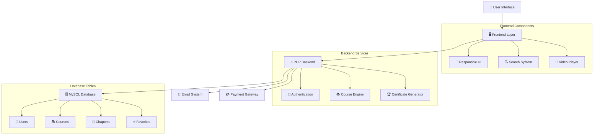

# 🎓 EduJam - Online Learning Platform

<div align="center">


*A comprehensive online learning platform offering free courses with certificates and diplomas*

[🚀 Quick Start](#-quick-start) •
[📖 Documentation](#-documentation) •
[🛠️ Installation](#%EF%B8%8F-installation-guide) •
[🤝 Contributing](#-contributing)

</div>

---

## 📋 Table of Contents

- [🌟 Features](#-features)
- [🏗️ System Architecture](#%EF%B8%8F-system-architecture)
- [⚡ Quick Start](#-quick-start)
- [🛠️ Installation Guide](#%EF%B8%8F-installation-guide)
- [📁 Project Structure](#-project-structure)
- [💾 Database Schema](#-database-schema)
- [🚀 Usage](#-usage)
- [🔧 Configuration](#-configuration)
- [🤝 Contributing](#-contributing)
- [📄 License](#-license)

---

## 🌟 Features

### 🎯 Core Learning Features
- **📚 Course Management** - Comprehensive course catalog with categories and filtering
- **🎥 Video Content** - Embedded video lectures with progress tracking
- **📖 Chapter Navigation** - Structured learning with modules and chapters
- **🏆 Certification System** - Digital certificates and diplomas upon completion
- **⭐ Course Rating** - User favorites and course recommendations

### 👤 User Experience
- **🔐 User Authentication** - Secure login/registration with session management
- **👥 Profile Management** - Personalized user profiles with course history
- **🔍 Advanced Search** - Multi-criteria course search and filtering
- **📱 Responsive Design** - Mobile-friendly interface across all devices
- **🌐 Multi-language Support** - Course content in multiple languages

### 💳 Premium Features
- **💎 Premium Subscriptions** - Monthly/yearly premium plans
- **💳 Payment Integration** - Secure payment processing for certificates
- **📊 Analytics Dashboard** - Learning progress and statistics
- **📧 Email Notifications** - Course updates and reminders

### 🛠️ Administrative Tools
- **📈 Course Analytics** - Detailed course performance metrics
- **👨‍🏫 Content Management** - Easy course creation and editing
- **👥 User Management** - Admin panel for user oversight
- **📊 Reporting System** - Comprehensive learning reports

---

## 🏗️ System Architecture



---

## ⚡ Quick Start

### Prerequisites
- 🖥️ Web server (Apache/Nginx)
- 🐘 PHP 8.0 or higher
- 🗄️ MySQL 5.7 or higher
- 🌐 Modern web browser

### 🚀 Launch Commands

```bash
# Clone the repository
git clone https://github.com/yourusername/edujam.git
cd edujam

# Import database
mysql -u root -p < database/edujam.sql

# Configure database connection
cp config/config.example.php config/config.php
# Edit config.php with your database credentials

# Start local server
php -S localhost:8000
```

Visit `http://localhost:8000` to access the platform!

---

## 🛠️ Installation Guide

### Step 1: 🔧 Environment Setup

#### Install XAMPP/WAMP (Windows) or LAMP (Linux)
```bash
# Ubuntu/Debian
sudo apt update
sudo apt install apache2 mysql-server php php-mysql

# Enable Apache modules
sudo a2enmod rewrite
sudo systemctl restart apache2
```

#### Install Composer (PHP Package Manager)
```bash
# Download and install Composer
curl -sS https://getcomposer.org/installer | php
sudo mv composer.phar /usr/local/bin/composer
```

### Step 2: 🗄️ Database Setup

#### Create Database
```sql
CREATE DATABASE edujam CHARACTER SET utf8mb4 COLLATE utf8mb4_unicode_ci;
CREATE USER 'edujam_user'@'localhost' IDENTIFIED BY 'your_password';
GRANT ALL PRIVILEGES ON edujam.* TO 'edujam_user'@'localhost';
FLUSH PRIVILEGES;
```

#### Import Database Schema
```bash
mysql -u edujam_user -p edujam < database/schema.sql
mysql -u edujam_user -p edujam < database/sample_data.sql
```

### Step 3: ⚙️ Application Configuration

#### Configure Database Connection
```php
// conection.php
$servername = "localhost";
$username = "edujam_user";
$password = "your_password";
$dbname = "edujam";

$conn = new mysqli($servername, $username, $password, $dbname);
```

#### Set File Permissions
```bash
sudo chown -R www-data:www-data /var/www/html/edujam
sudo chmod -R 755 /var/www/html/edujam
sudo chmod -R 777 /var/www/html/edujam/uploads
```

### Step 4: 🔧 Web Server Configuration

#### Apache Virtual Host
```apache
<VirtualHost *:80>
    ServerName edujam.local
    DocumentRoot /var/www/html/edujam
    
    <Directory /var/www/html/edujam>
        AllowOverride All
        Require all granted
    </Directory>
    
    ErrorLog ${APACHE_LOG_DIR}/edujam_error.log
    CustomLog ${APACHE_LOG_DIR}/edujam_access.log combined
</VirtualHost>
```

---

## 📁 Project Structure

```
EDUJAM/
│
├── 📂 assets/                           # Static Assets
│   ├── 🎨 css/
│   │   ├── style.css                   # Main stylesheet
│   │   ├── Estilos.css                 # Additional styles
│   │   └── style_footer.css            # Footer styles
│   ├── 📱 js/
│   │   └── script.js                   # JavaScript functionality
│   └── 🖼️ images/                      # Image assets
│
├── 📂 core/                            # Core Application
│   ├── 🔗 conection.php               # Database connection
│   ├── 📊 get_cours.php               # Course data fetcher
│   ├── 📚 get_courses.php             # Course listing logic
│   ├── 📖 get_modul.php               # Module data handler
│   └── ❤️ get_heart.php               # Favorites system
│
├── 📂 pages/                           # Main Pages
│   ├── 🏠 index.php                   # Homepage
│   ├── 📚 courses.php                 # Course catalog
│   ├── 📖 course.php                  # Course details
│   ├── 📝 chapiter.php                # Chapter viewer
│   ├── ℹ️ morinfo.php                 # Course information
│   ├── ❤️ courseheart.php             # User favorites
│   └── 💎 gopremium.php               # Premium subscription
│
├── 📂 components/                      # Reusable Components
│   ├── 🔝 header.php                  # Site header
│   ├── 🔽 footer.php                  # Site footer
│   └── 🔽 foter.php                   # Footer wrapper
│
├── 📂 auth/                           # Authentication System
│   └── 📂 login/                      # Login module
│       ├── 🔐 index.php              # Login page
│       └── ⚙️ php/config.php         # Auth configuration
│
├── 📂 payment/                        # Payment System
│   ├── 💳 payer.html                 # Payment interface
│   ├── 🛒 shop.html                  # Shopping cart
│   └── ❤️ insert_heart.php           # Add to favorites
│
├── 📂 database/                       # Database Files
│   ├── 🗄️ schema.sql                 # Database structure
│   └── 📊 sample_data.sql            # Sample course data
│
└── 📖 README.md                      # Project documentation
```

---

## 💾 Database Schema

### 👥 Users Management
| Table | Description |
|-------|-------------|
| `users` | User profiles and authentication |
| `user_login` | Login credentials and sessions |

#### Users Table Structure
```sql
CREATE TABLE users (
    Id INT AUTO_INCREMENT PRIMARY KEY,
    Username VARCHAR(100) UNIQUE NOT NULL,
    Email VARCHAR(150) UNIQUE NOT NULL,
    Password VARCHAR(255) NOT NULL,
    prenom VARCHAR(100),
    image LONGBLOB,
    created_at TIMESTAMP DEFAULT CURRENT_TIMESTAMP
);
```

### 📚 Course System
| Table | Description |
|-------|-------------|
| `cours` | Course categories and metadata |
| `cours_modul` | Individual course modules |
| `modul` | Course module structure |
| `chapiters` | Chapter organization |
| `cours_chapiters` | Chapter content and videos |

#### Course Tables Structure
```sql
CREATE TABLE cours_modul (
    id INT AUTO_INCREMENT PRIMARY KEY,
    name VARCHAR(200) NOT NULL,
    category VARCHAR(100),
    image LONGBLOB,
    descriptif TEXT,
    hrs1 INT,
    hrs2 INT,
    nmbr INT DEFAULT 0,
    date DATE DEFAULT CURRENT_DATE
);

CREATE TABLE chapiters (
    id INT AUTO_INCREMENT PRIMARY KEY,
    modul_id INT,
    name VARCHAR(200) NOT NULL,
    description TEXT,
    FOREIGN KEY (modul_id) REFERENCES modul(id)
);
```

### ⭐ User Interactions
| Table | Description |
|-------|-------------|
| `heart` | User favorite courses |
| `progress` | Learning progress tracking |

#### Favorites System
```sql
CREATE TABLE heart (
    id INT AUTO_INCREMENT PRIMARY KEY,
    heart INT NOT NULL,
    id_user INT NOT NULL,
    created_at TIMESTAMP DEFAULT CURRENT_TIMESTAMP,
    UNIQUE KEY unique_favorite (heart, id_user)
);
```

---

## 🚀 Usage

### 🏠 Homepage Features
- **Course Categories**: Browse courses by subject area
- **Featured Courses**: Highlighted popular and new courses
- **Search Functionality**: Find courses by keywords
- **User Authentication**: Login/register access

### 📚 Course Management

#### For Students:
```php
// Browse courses by category
$category = $_GET['category'];
$courses = getCoursesByCategory($category);

// Add course to favorites
$courseId = $_POST['course_id'];
$userId = $_SESSION['user_id'];
addToFavorites($userId, $courseId);

// Track learning progress
updateProgress($userId, $chapterId, $completed = true);
```

#### For Administrators:
```php
// Create new course
$courseData = [
    'name' => $courseName,
    'category' => $category,
    'description' => $description,
    'duration' => $duration
];
createCourse($courseData);

// Add chapter content
$chapterContent = [
    'course_id' => $courseId,
    'title' => $chapterTitle,
    'content' => $content,
    'video' => $videoFile
];
addChapter($chapterContent);
```

### 🎥 Video Learning System

#### Chapter Navigation
- **Sequential Learning**: Navigate through chapters in order
- **Progress Tracking**: Mark chapters as completed
- **Video Playback**: Embedded video player with controls
- **Content Display**: Text content alongside videos

### 🔍 Search and Filtering

#### Advanced Search Options:
- **By Category**: Filter courses by subject
- **By Duration**: Find courses by time commitment
- **By Level**: Beginner, Intermediate, Advanced
- **By Language**: Multiple language options

### 💎 Premium Features

#### Subscription Management:
```php
// Premium user benefits
if (isPremiumUser($userId)) {
    // No advertisements
    // Exclusive content access
    // Certificate discounts
    // Priority support
}

// Process premium subscription
$subscription = [
    'user_id' => $userId,
    'plan' => 'monthly', // or 'yearly'
    'amount' => 7.99,
    'payment_method' => 'stripe'
];
processPremiumSubscription($subscription);
```

---

## 🔧 Configuration

### 📧 Email Configuration
```php
// Email settings for notifications
$emailConfig = [
    'smtp_host' => 'smtp.gmail.com',
    'smtp_port' => 587,
    'smtp_username' => 'your-email@gmail.com',
    'smtp_password' => 'your-app-password',
    'from_email' => 'noreply@edujam.com',
    'from_name' => 'EduJam Platform'
];
```

### 💳 Payment Gateway Setup
```php
// Stripe configuration
$stripeConfig = [
    'public_key' => 'pk_test_...',
    'secret_key' => 'sk_test_...',
    'webhook_secret' => 'whsec_...'
];

// PayPal configuration
$paypalConfig = [
    'client_id' => 'your-paypal-client-id',
    'client_secret' => 'your-paypal-secret',
    'mode' => 'sandbox' // or 'live'
];
```

### 🔒 Security Settings
```php
// Security configuration
ini_set('session.cookie_httponly', 1);
ini_set('session.cookie_secure', 1);
ini_set('session.use_strict_mode', 1);

// CSRF protection
function generateCSRFToken() {
    return bin2hex(random_bytes(32));
}

// Input sanitization
function sanitizeInput($input) {
    return htmlspecialchars(trim($input), ENT_QUOTES, 'UTF-8');
}
```

---

## 🎨 Customization

### 🎨 Theming System
```css
/* Custom CSS variables for easy theming */
:root {
    --primary-color: #48a3d3;
    --secondary-color: #f49b29;
    --success-color: #4caf50;
    --danger-color: #f44336;
    --dark-color: #333;
    --light-color: #f8f9fa;
}

/* Responsive design breakpoints */
@media (max-width: 768px) {
    .container {
        padding: 10px;
    }
}
```

### 📱 Mobile Responsiveness
```javascript
// Mobile menu toggle
function toggleMobileMenu() {
    const navLinks = document.getElementById('navLinks');
    navLinks.classList.toggle('active');
}

// Touch-friendly course cards
function initTouchEvents() {
    const courseCards = document.querySelectorAll('.course-card');
    courseCards.forEach(card => {
        card.addEventListener('touchstart', handleTouch);
    });
}
```

---

## 🔍 API Endpoints

### 📚 Course API
```php
// Get all courses
GET /api/courses
// Response: [{"id": 1, "name": "Course Name", "category": "IT"}]

// Get course by ID
GET /api/courses/{id}
// Response: {"id": 1, "name": "Course Name", "modules": [...]}

// Search courses
GET /api/courses/search?q=keyword&category=IT
// Response: [{"id": 1, "name": "Matching Course"}]
```

### 👤 User API
```php
// User authentication
POST /api/auth/login
// Body: {"email": "user@example.com", "password": "password"}

// Get user profile
GET /api/user/profile
// Headers: Authorization: Bearer {token}

// Update user preferences
PUT /api/user/preferences
// Body: {"language": "en", "notifications": true}
```

---

## 🧪 Testing

### 🔧 Unit Testing
```php
// PHPUnit test example
class CourseTest extends PHPUnit\Framework\TestCase {
    public function testCourseCreation() {
        $course = new Course('Test Course', 'IT');
        $this->assertEquals('Test Course', $course->getName());
        $this->assertEquals('IT', $course->getCategory());
    }
    
    public function testCourseEnrollment() {
        $user = new User('test@example.com');
        $course = new Course('Test Course', 'IT');
        
        $result = $course->enrollUser($user);
        $this->assertTrue($result);
    }
}
```

### 🌐 Integration Testing
```javascript
// JavaScript testing with Jest
describe('Course Search', () => {
    test('should filter courses by category', async () => {
        const courses = await searchCourses('category=IT');
        expect(courses.length).toBeGreaterThan(0);
        expect(courses[0].category).toBe('IT');
    });
});
```

---

## 🚀 Deployment

### 🐳 Docker Deployment
```dockerfile
# Dockerfile
FROM php:8.0-apache

# Install dependencies
RUN docker-php-ext-install mysqli pdo pdo_mysql

# Copy application files
COPY . /var/www/html/

# Set permissions
RUN chown -R www-data:www-data /var/www/html
RUN chmod -R 755 /var/www/html

EXPOSE 80
```

```yaml
# docker-compose.yml
version: '3.8'
services:
  web:
    build: .
    ports:
      - "8080:80"
    depends_on:
      - db
    volumes:
      - .:/var/www/html
      
  db:
    image: mysql:8.0
    environment:
      MYSQL_ROOT_PASSWORD: root
      MYSQL_DATABASE: edujam
    ports:
      - "3306:3306"
    volumes:
      - mysql_data:/var/lib/mysql

volumes:
  mysql_data:
```

### ☁️ Cloud Deployment
```bash
# Deploy to AWS EC2
# 1. Launch EC2 instance
aws ec2 run-instances --image-id ami-0abcdef1234567890 --instance-type t2.micro

# 2. Install dependencies
sudo yum update -y
sudo yum install -y httpd php php-mysql mysql

# 3. Deploy application
git clone https://github.com/yourusername/edujam.git /var/www/html/
sudo systemctl start httpd
sudo systemctl enable httpd
```

---

## 🤝 Contributing

We welcome contributions to improve EduJam! Here's how you can help:

### 🔧 Development Workflow

1. **Fork the repository**
2. **Create a feature branch**
   ```bash
   git checkout -b feature/amazing-feature
   ```
3. **Make your changes**
   - Follow PSR-4 coding standards
   - Add comprehensive comments
   - Update documentation
4. **Test your changes**
   ```bash
   php vendor/bin/phpunit tests/
   ```
5. **Commit your changes**
   ```bash
   git commit -m 'Add amazing feature'
   ```
6. **Push to your fork**
   ```bash
   git push origin feature/amazing-feature
   ```
7. **Open a Pull Request**

### 📝 Contribution Guidelines

#### Code Standards
- ✅ Follow PSR-4 autoloading standards
- ✅ Use meaningful variable and function names
- ✅ Add DocBlocks for all functions and classes
- ✅ Maintain consistent indentation (4 spaces)
- ✅ Write unit tests for new features

#### Security Best Practices
- 🔒 Validate and sanitize all user inputs
- 🔒 Use prepared statements for database queries
- 🔒 Implement proper session management
- 🔒 Follow OWASP security guidelines

### 🐛 Bug Reports

When reporting bugs, please include:
- 🖥️ Operating system and version
- 🌐 Browser and version
- 🐘 PHP version
- 📝 Steps to reproduce the issue
- 📋 Expected vs actual behavior
- 🖼️ Screenshots (if applicable)

### 💡 Feature Requests

For new features, please provide:
- 🎯 Clear description of the feature
- 🚀 Use case and benefits
- 🔧 Suggested implementation approach
- 📊 Impact on existing functionality

---

## 📊 Performance Optimization

### 🔄 Caching Strategy
```php
// Redis caching implementation
class CourseCache {
    private $redis;
    
    public function __construct() {
        $this->redis = new Redis();
        $this->redis->connect('127.0.0.1', 6379);
    }
    
    public function getCourses($category) {
        $key = "courses:$category";
        $cached = $this->redis->get($key);
        
        if ($cached) {
            return json_decode($cached, true);
        }
        
        $courses = $this->fetchCoursesFromDB($category);
        $this->redis->setex($key, 3600, json_encode($courses));
        
        return $courses;
    }
}
```

### 📈 Database Optimization
```sql
-- Add indexes for better performance
CREATE INDEX idx_course_category ON cours_modul(category);
CREATE INDEX idx_user_email ON users(Email);
CREATE INDEX idx_chapter_module ON chapiters(modul_id);

-- Optimize queries
EXPLAIN SELECT * FROM cours_modul WHERE category = 'IT';
```

---

## 🔒 Security Features

### 🛡️ Authentication & Authorization
- **Secure Password Hashing**: Using PHP's `password_hash()`
- **Session Management**: Secure session handling with regeneration
- **CSRF Protection**: Token-based CSRF prevention
- **SQL Injection Prevention**: Prepared statements throughout
- **XSS Protection**: Input sanitization and output encoding

### 🔐 Data Protection
```php
// Password hashing
function hashPassword($password) {
    return password_hash($password, PASSWORD_ARGON2ID);
}

// Input validation
function validateEmail($email) {
    return filter_var($email, FILTER_VALIDATE_EMAIL);
}

// CSRF token generation
function generateCSRFToken() {
    if (!isset($_SESSION['csrf_token'])) {
        $_SESSION['csrf_token'] = bin2hex(random_bytes(32));
    }
    return $_SESSION['csrf_token'];
}
```

---

## 📄 License

This project is licensed under the MIT License - see the [LICENSE](LICENSE) file for details.

---

## 🙏 Acknowledgments

- 📚 [Font Awesome](https://fontawesome.com/) for icons
- 🎨 [Google Fonts](https://fonts.google.com/) for typography
- 🖼️ [Unsplash](https://unsplash.com/) for course images
- 💳 [Stripe](https://stripe.com/) for payment processing
- 📧 [PHPMailer](https://github.com/PHPMailer/PHPMailer) for email functionality

---

## 📞 Support & Community

- 📧 **Email**: support@edujam.com
- 🐛 **Issues**: [GitHub Issues](https://github.com/yourusername/edujam/issues)
- 📖 **Documentation**: [Project Wiki](https://github.com/yourusername/edujam/wiki)
- 💬 **Discussions**: [GitHub Discussions](https://github.com/yourusername/edujam/discussions)
- 🌟 **Website**: [EduJam Platform](https://edujam.com)

---

## 🗺️ Roadmap

### 📅 Version 2.0 (Q2 2024)
- [ ] 🎮 Gamification system with badges and points
- [ ] 🤖 AI-powered course recommendations
- [ ] 📱 Mobile app for iOS and Android
- [ ] 🌍 Multi-language content support
- [ ] 📊 Advanced analytics dashboard

### 📅 Version 2.5 (Q3 2024)
- [ ] 🎥 Live streaming capabilities
- [ ] 👥 Group learning features
- [ ] 🔗 Integration with popular LMS platforms
- [ ] 🎯 Personalized learning paths
- [ ] 📝 Interactive assessments and quizzes

### 📅 Version 3.0 (Q4 2024)
- [ ] 🤖 Chatbot support system
- [ ] 🔊 Audio-only course format
- [ ] 📱 Progressive Web App (PWA)
- [ ] 🌐 Multi-tenant architecture
- [ ] 🔒 Advanced security features

---

<div align="center">

**Made with ❤️ for learners worldwide**

[](https://github.com/yourusername/edujam/stargazers)
[](https://github.com/yourusername/edujam/network/members)
[](https://github.com/yourusername/edujam/issues)
[](https://github.com/yourusername/edujam/blob/main/LICENSE)

</div>
